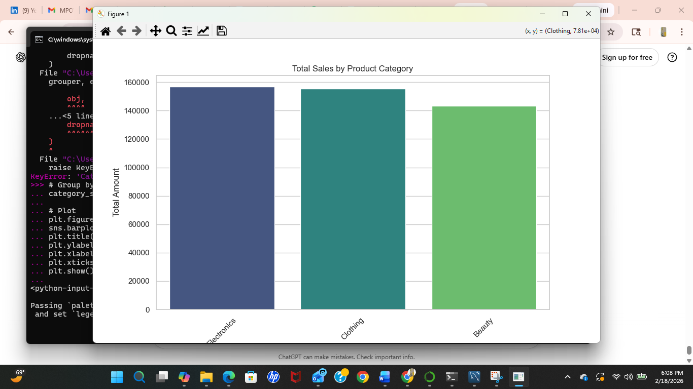

# ETL Sales Pipeline

This project demonstrates an end-to-end ETL pipeline for retail sales data:

- **Extract** data from CSV  
- **Transform** and clean data using Python (pandas)  
- **Load** data into MySQL  
- **Analytics / Visualization**: optional charts with Python (matplotlib & seaborn)

### Project Outcome
- Automated pipeline for sales data processing  
- Clean, transformed dataset ready for analysis  
- Visualization showing total sales by product category

### Skills & Tools
- Python (pandas, matplotlib, seaborn)  
- SQL / MySQL  
- ETL process understanding  
- Data cleaning and transformation  
- Basic data visualization

### Data
- Raw data: `rawdata/retail_sales_dataset.csv`  
- Transformed data: `rawdata/transformed_sales.csv`

### Visualization
Total sales by product category:

